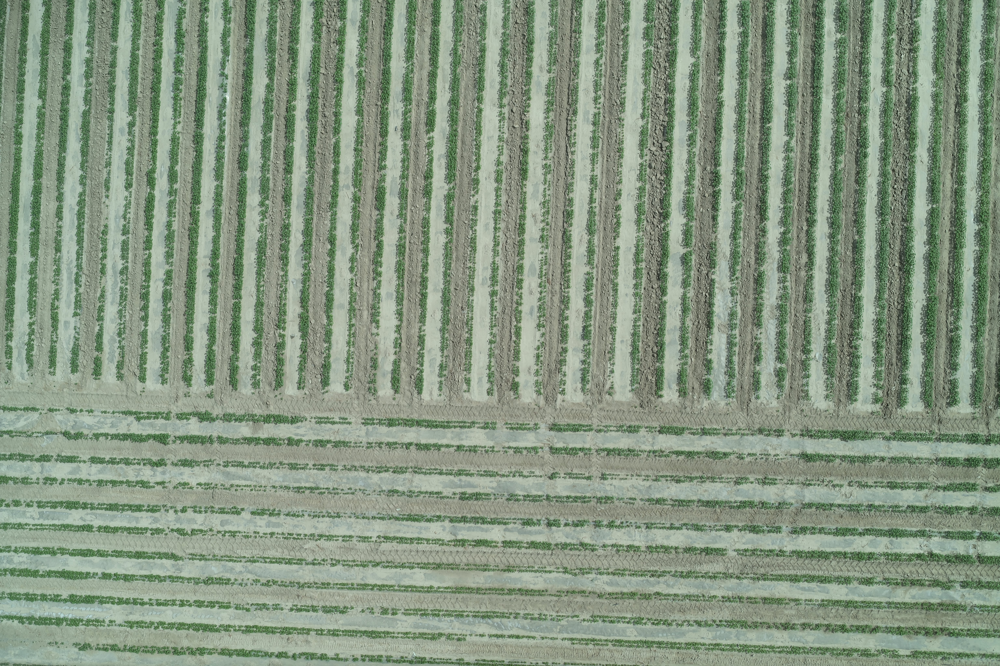
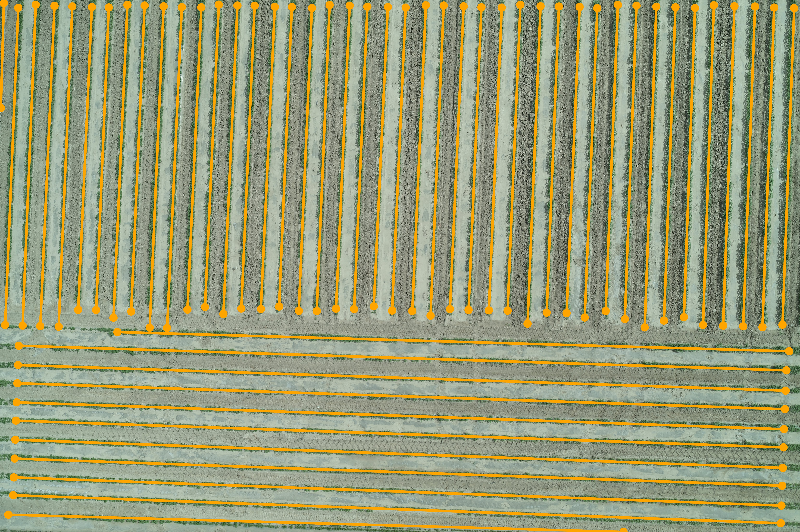

# Cotton Row Direction Detection

基于 HSV 植被分割、概率 Hough 方向估计和一维投影峰值检测的棉花种植行识别工具。最新版脚本是单文件实现，不依赖仓库中的 V1/V2 历史脚本。

## 功能

- HSV 强植被分割与 ExG 弱苗增强；
- 使用 Hough 候选线段的长度加权轴向均值估计主要种植方向；
- 支持一次上下正交方向区域切换；
- 将每条种植行输出为有真实植被支持的有限线段；
- 输出植被掩膜、行线叠加图、结构化 JSON 和批处理摘要。

概率 Hough 变换返回有限线段端点，本项目利用这些候选线段估计全局方向，而每条种植行的最终位置由旋正后的横向投影峰确定。[1] SciPy `find_peaks` 根据峰间距和显著度筛选一维投影峰。[2]

## 运行环境

- Python 3.10–3.14（建议使用仍受支持的 64 位 CPython）；
- Windows、Linux 或 macOS；
- 依赖：OpenCV、NumPy、SciPy。

本项目不调用 `cv2.imshow` 等 GUI 功能，因此依赖清单使用体积和系统依赖更小的 `opencv-python-headless`。OpenCV 官方也建议在服务器、容器以及不使用 OpenCV GUI 的程序中选择 headless 包，而且同一环境不要同时安装多个 OpenCV wheel 变体。[3]

## 安装

```bash
git clone https://github.com/hegyixenia162-beep/row_direction_detect.git
cd row_direction_detect

python -m venv .venv
```

Windows PowerShell 激活虚拟环境：

```powershell
.\.venv\Scripts\Activate.ps1
python -m pip install --upgrade pip
python -m pip install -r requirements.txt
```

Linux 或 macOS 激活虚拟环境：

```bash
source .venv/bin/activate
python -m pip install --upgrade pip
python -m pip install -r requirements.txt
```

## 快速开始

仓库不包含无人机测试航片。把自己的图片放入 `test_photo` 后运行：

```bash
python run_hsv_hough_latest.py
```

也可以直接处理任意位置的一张图片：

```bash
python run_hsv_hough_latest.py --input /path/to/cotton_field.jpg
```

处理指定目录中的全部支持图片：

```bash
python run_hsv_hough_latest.py --input /path/to/images --output /path/to/results
```

只处理目录中的指定图片：

```bash
python run_hsv_hough_latest.py --input /path/to/images --names photo1.jpg photo2.jpg
```

Windows 路径示例：

```powershell
python run_hsv_hough_latest.py --input "D:\data\cotton\photo6.jpg"
```

查看全部参数：

```bash
python run_hsv_hough_latest.py --help
```

## 算法处理示例

以下示例使用 `photo6` 展示算法处理前后的效果。公开版原图保持原始分辨率，但已移除 EXIF/GPS 定位元数据；结果图由无元数据的 PNG 转换为高质量 JPEG，以减少仓库体积和页面加载时间。

| 原始棉田航片 | 种植行检测结果 |
|---|---|
|  |  |

## 输出文件

默认写入 `outputs_latest`：

```text
outputs_latest/
├── <图片名>_mask_latest.png       # 黑白植被掩膜
├── <图片名>_rows_latest.png       # 橙色种植行叠加图
├── <图片名>_rows_latest.json      # 行线坐标与质量指标
└── run_summary_latest.json        # 本批次成功/失败摘要
```

JSON 中的行距和线段长度单位均为原图像素。要换算成实际距离，需要另行提供影像 GSD；代码不会根据像素值推测厘米或米。

## 常用参数

| 参数 | 默认值 | 说明 |
|---|---:|---|
| `--max-side` | 1800 | 计算工作图最长边 |
| `--h-min` | 25 | 强植被 HSV 色相下限 |
| `--h-max` | 100 | 强植被 HSV 色相上限 |
| `--s-min` | 35 | 强植被饱和度下限 |
| `--v-min` | 25 | 强植被亮度下限 |
| `--min-component` | 18 | 工作尺度最小强植被连通域面积 |
| `--angle-tolerance` | 12° | Hough 主方向候选容差 |

这些阈值是当前棉田影像上的经验参数，不是跨相机、光照、生育期和土壤背景都成立的农学常数。迁移到新数据集时，应使用独立人工标注样本重新验证。

## 当前算法边界

- 适用于近似直线、行间距较规律且植被具有可分辨绿色响应的棉田影像；
- 区域判断目前只支持一次水平边界及约 90° 的方向切换；
- 暂不专门处理弯曲行、任意多地块、严重杂草覆盖和畦内双行；
- 这是传统图像处理流程，不是经过训练的深度学习模型。

## 仓库结构

```text
run_hsv_hough_latest.py   # 推荐使用的独立最新版
run_hsv_hough.py          # V1 历史版本
run_hsv_hough_v2.py       # V2 历史版本
requirements.txt          # Python 依赖
test_photo/               # 用户自行放置测试图片
outputs*/                 # 检测结果
annotation_tool/          # 浏览器人工线段标注前端
annotate_server.py        # 标注工具本地服务
annotations/manual/       # 已有人工标注 JSON
docs/                     # 中文说明文档
```

## 许可证

当前仓库尚未添加开源许可证。在许可证确定之前，公开可见不等于他人获得复制、修改或分发代码的许可。[4] 仓库所有者应根据希望允许的使用范围选择并添加 `LICENSE` 文件。

## 参考资料

[1] OpenCV. *Hough Line Transform* [EB/OL]. OpenCV Documentation, 2026. https://docs.opencv.org/4.x/d9/db0/tutorial_hough_lines.html (accessed 2026-08-28).

[2] SciPy Community. *scipy.signal.find_peaks — SciPy API Reference* [EB/OL]. SciPy Documentation, 2026. https://docs.scipy.org/doc/scipy/reference/generated/scipy.signal.find_peaks.html (accessed 2026-08-28).

[3] OpenCV on Wheels. *opencv-python: Installation and Usage* [EB/OL]. Python Package Index, 2026. https://pypi.org/project/opencv-python/ (accessed 2026-08-28).

[4] GitHub. *No License* [EB/OL]. Choose a License, 2026. https://choosealicense.com/no-permission/ (accessed 2026-08-28).
